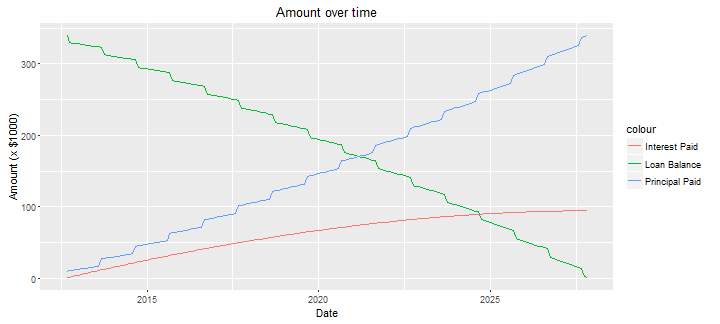

    
## Introduction

1. Mortgage Primer is a simple mortgage analysis tool
2. It is hosted on shinyapps.io server at  <https://adeyemiarogunmati.shinyapps.io/Primer/>
3. It is designed to be used for multiple purposes
    - simple mortgage monthly payment calculation
    - loan balance calculation after n months
    - loan term required to produce monthly payment given balance
    - assessing balance reduction with or without additional payments
4. It is user friendly and visually appealing

--- .class #id 

## Example Mortgage Calculation

- Mortgage Primer (MP) functions are defined on the shiny server side

- These functions are hidden from the user

- To calculate mortgage payments, MP calls its **calcMortgagePayment** function


- An example function call is shown below:


```r
apr  <- 3.375
loan <- 340000
term <- 30
calcMortgagePayment (apr,loan,term)
```

```
## [1] 1503.13
```

--- .class #id 

## Example Loan Payment Assessment

- To assess loan balance reduction with yearly additional payments, MP calls its **calcAmortizationScheduleWithYearlyPrincipal** function


- For the previous example, to assess loan figures with yearly additional payment of $10,000, MP calls:


```r
d <- calcAmortizationScheduleWithYearlyPrincipal(apr,loan,term,10000)
```



--- .class #id 

## Conclusions

- Mortgage Primer (MP) is an easy to use mortgage analysis tool
- Its functions are defined in files hosted on the shiny.io server
- Its plots are created with visually appealing ggplot calls
- MP can be accessed by clicking this [web link] (https://adeyemiarogunmati.shinyapps.io/Primer/)

